Weems, Virginia is a place most people have never heard of and need a magnifying glass to find on a map. It’s a weird name for such a tiny town; one so tiny its population is only around 1,400 and its post office closed last year. Weems, located on the Northern Neck peninsula, is near the mouth of the Chesapeake Bay and is home to two groups of people: “been-heres” and “come-heres”.

The closest markers of convenience are the Walmart and Front Porch Coffee House which are both twenty minutes away from Sabrina’s parents’ house. All activities involve the “Rivah” down there. Kayaking is the best way to enjoy the scenery along the Corrotoman River and its various wildlife. On kayaking trips I have seen fish, turtles, crabs, raccoons, deer, snakes, and many, many birds. My “white whale” on each trip is to capture a decent photograph of a Blue Heron; a bird which eludes me almost every trip because it is so skittish I cannot get within three-hundred feet before it flies away with its mocking “roh-roh-roh” call. I have since come to enjoy the solitude of Weems, and find it a necessary reprieve from my busy schedule.

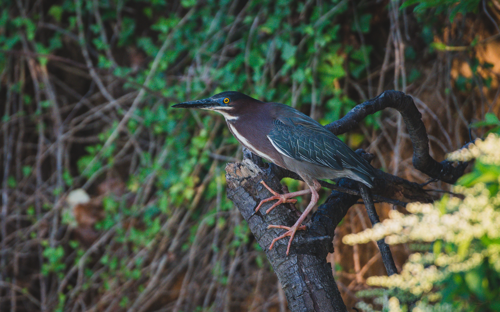

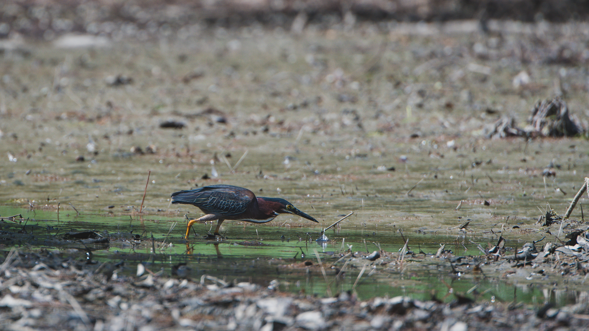

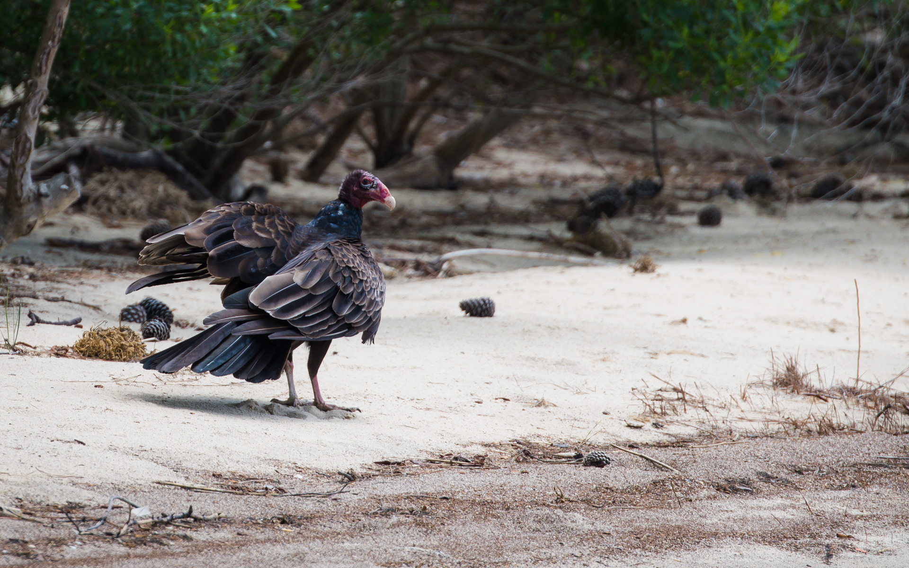

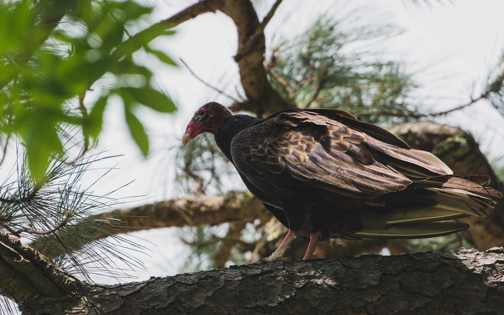

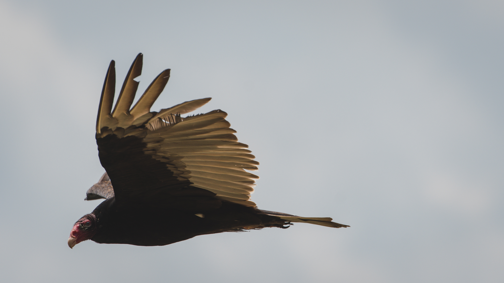

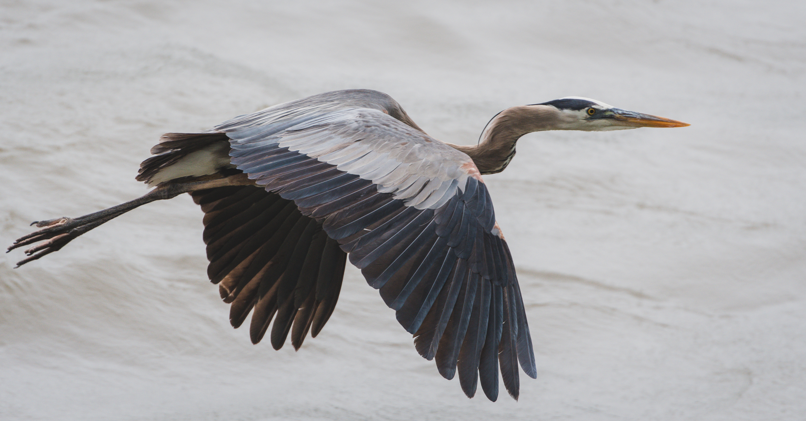

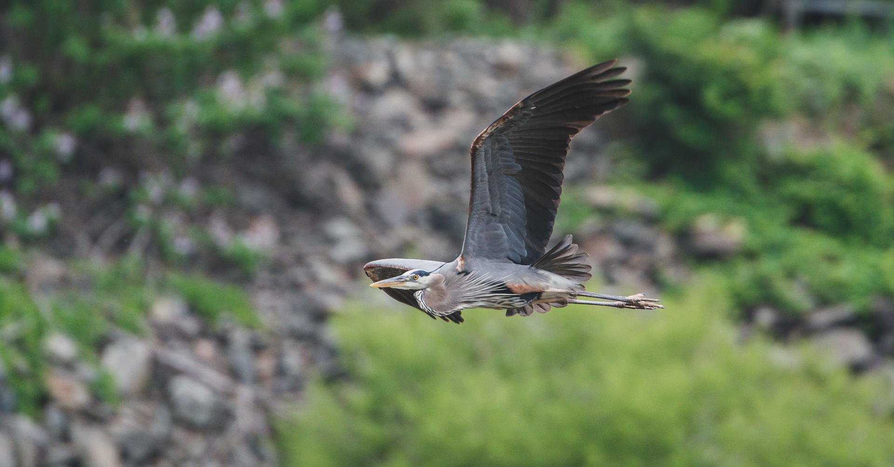

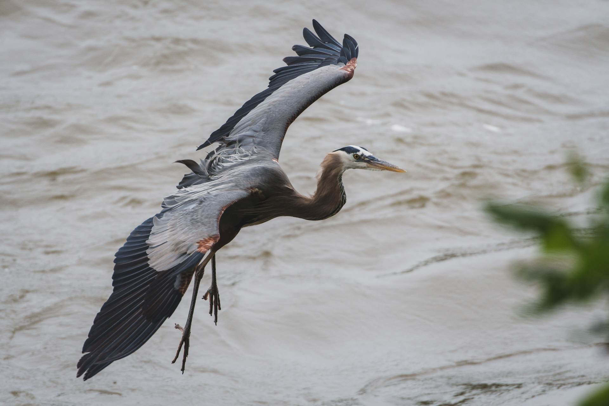

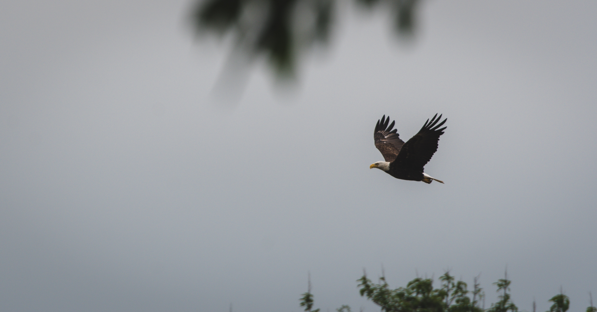

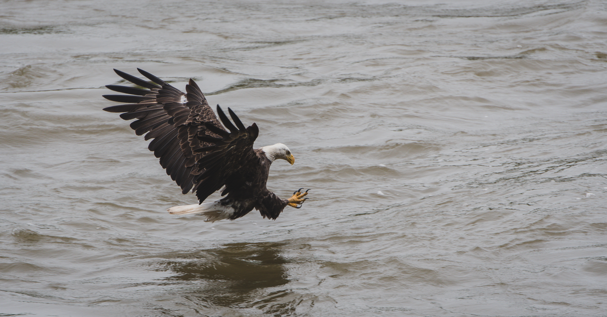

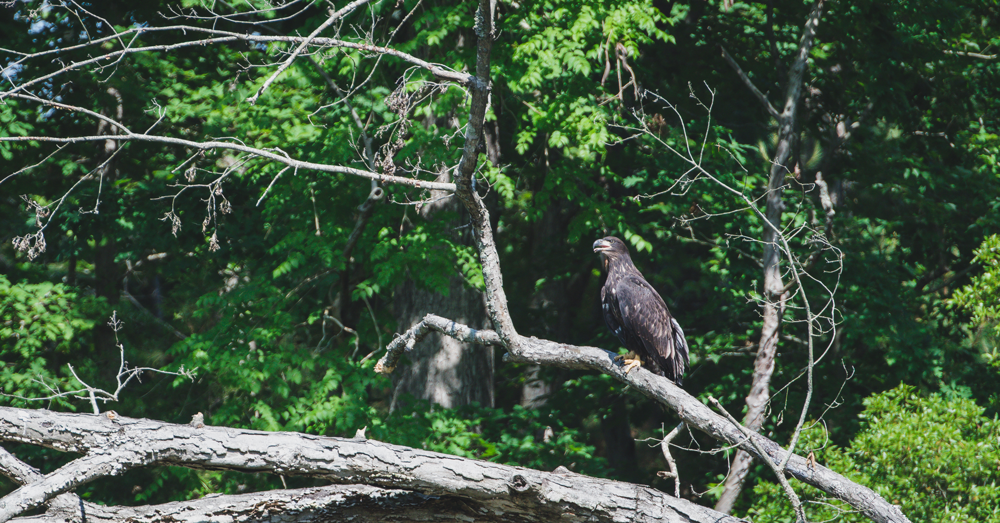
