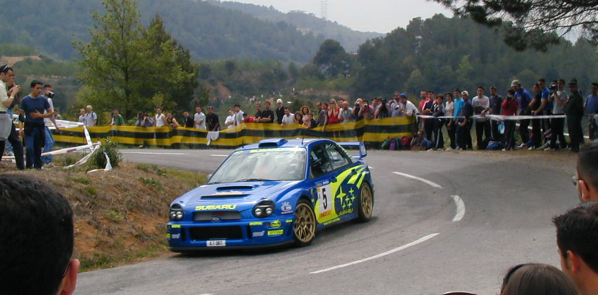

## The inspiration for the kit

#### Piloted by Richard Burns and Robert Reid the Subaru Impreza WRC 2001

> Having mechanical components tested through half of the previous season, the Subaru Impreza WRC 2001’s body was new for 2001. It had four doors instead of two, and it was designed for improved aerodynamics, which included moving the rear wing further to the back of the car. In addition, the body shell benefited from increased strength and improved weight distribution, along with a lower center of gravity.

> The powertrain and chassis taken from the Impreza WRC 2000 included lightweight engine design, up-to-date engine control unit, and specially designed intake and exhaust manifolds, cooling system, rear differential, and suspension geometry. Mechanical components were refined for 2001, but the foundation had been laid the year before.

_"Excert from driveperformance.subaru.com"_

## My Subaru obsession

Lorem ipsum dolor sit amet, consectetur adipiscing elit. Suspendisse ultrices est purus, sed rhoncus nunc ultrices sed. Praesent eget nunc et justo lobortis luctus vitae nec diam. Curabitur vitae elementum nisi. Morbi quis ex ultrices, laoreet nisi convallis, viverra dui. Donec molestie ultrices massa dignissim suscipit. Nulla aliquet, enim eget rhoncus aliquet, nulla dui hendrerit libero, eu ornare turpis nibh eu metus. Phasellus in sem sem. Suspendisse erat nibh, venenatis nec magna nec, fermentum gravida augue. Nulla fermentum lectus nec dui congue ullamcorper. Morbi sed finibus nisl. Vivamus eget justo et nulla imperdiet rhoncus. Maecenas bibendum sem turpis, in placerat nisi vulputate a. Maecenas et dictum sapien, volutpat eleifend erat.

Nam blandit ante quam, vel ultrices nulla facilisis ac. Ut sit amet ligula elit. Nunc vel massa consequat, tincidunt ligula eget, pharetra turpis. Pellentesque scelerisque feugiat mauris, non blandit ex porttitor non. Nulla dapibus non diam rhoncus rutrum. Morbi ac suscipit ex, id vestibulum diam. Etiam aliquam dapibus dui. Vestibulum leo lectus, dictum sed mauris et, mattis fermentum felis. Sed risus nunc, ullamcorper vel mauris vel, tempor auctor odio. Etiam consectetur pulvinar fringilla. Ut tincidunt facilisis quam sit amet pretium. Vestibulum nibh libero, aliquam ac dolor et, efficitur malesuada augue. Integer rutrum, tellus sed sollicitudin vehicula, elit mauris lobortis massa, vitae blandit arcu mi eget neque.

# The Build

## Tooling

- Xacto knife
- Model Master Liquid Cement
- Self-Healing Cutting Mat, Green/Black
- All Purpose Flush Cutter
- Disposable Gloves

## Paints

- Tamiya Fine Surface Primer
- Tamiya Color Spray Paint TS-19 Metallic blue
- Tamiya Color Spray Paint TS-29 Semi gloss black

## Assembly Steps

> Below you can find a step by step progress of my assembly of this kit.

> - Initial body assembly and light primer
> - Body assembly completion and additional prier and sanding
> - Subframe assembly and paint

#### Initial Body Assembly and Light Primer

> First coat of primer and minor body and wing assembly
