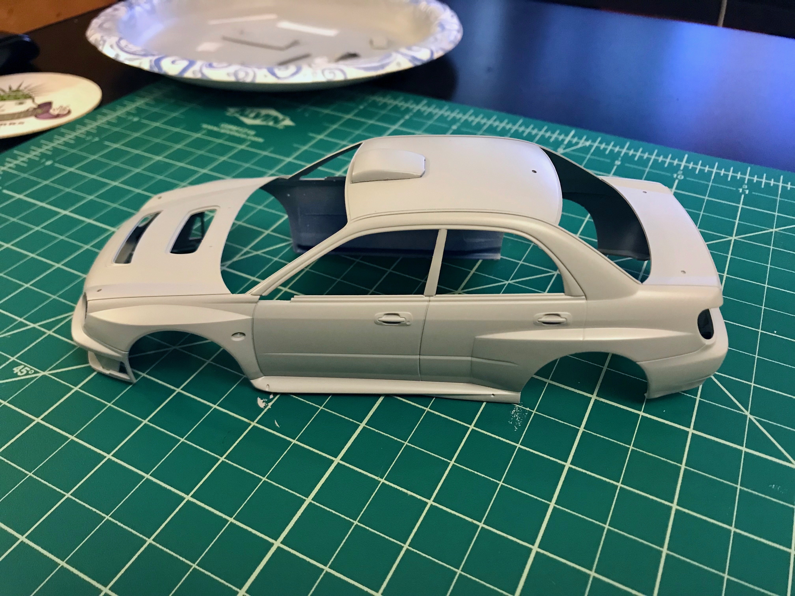

## The inspiration for the kit

#### Piloted by Richard Burns and Robert Reid the Subaru Impreza WRC 2001

> Having mechanical components tested through half of the previous season, the Subaru Impreza WRC 2001’s body was new for 2001. It had four doors instead of two, and it was designed for improved aerodynamics, which included moving the rear wing further to the back of the car. In addition, the body shell benefited from increased strength and improved weight distribution, along with a lower center of gravity.

> The powertrain and chassis taken from the Impreza WRC 2000 included lightweight engine design, up-to-date engine control unit, and specially designed intake and exhaust manifolds, cooling system, rear differential, and suspension geometry. Mechanical components were refined for 2001, but the foundation had been laid the year before.

_"Excert from driveperformance.subaru.com"_

## My obession

## Assembly

> Below you can find a step by step progress of my assembly of this kit.

#### Initial Body Assembly and Light Primer

> First coat of primer and minor body and wing assembly
